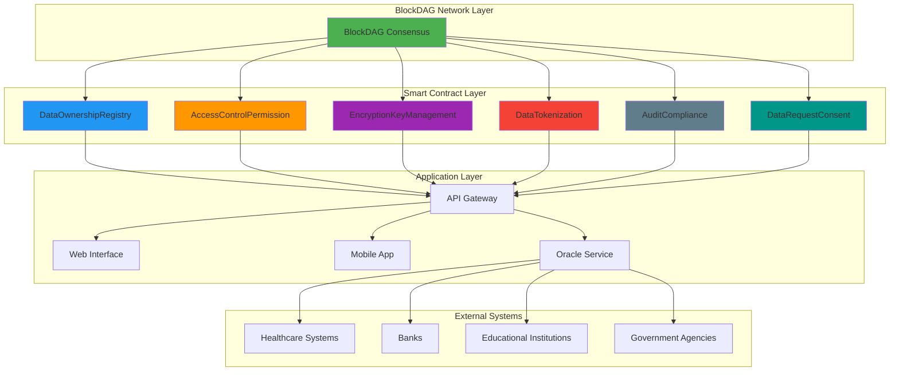

# BlockDAG Secure Data Transfer Platform

A decentralized, secure data ownership and transfer platform built on BlockDAG network with NIST/ISO cybersecurity compliance.

## System Architecture


## Contract Technical Stack

```yaml
Blockchain: 
  Network: BlockDAG
  Consensus: DAG-based
  Smart Contracts: Solidity 0.8.30

Development:
  Framework: Foundry
  Testing: Forge (Unit, Integration, Fuzz, Audit)
  Language: Solidity

Security:
  Standards: NIST/ISO 27001 Compliance
  Access Control: Role-Based (RBAC)
  Encryption: On-chain key management
  Audit: Comprehensive test coverage
```
## License
his project is licensed under the MIT License - see the [LICENSE.md](./LICENSE) file for details